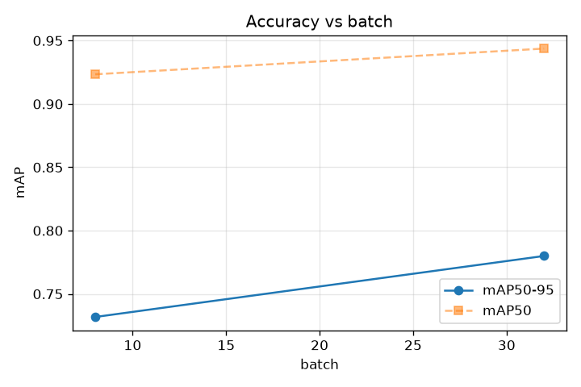
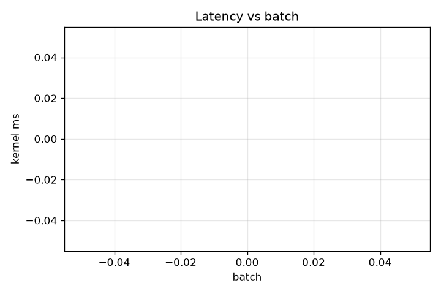

# batch sweep

Non-binary knob sweep — value → accuracy → latency. 2 runs. All other knobs at baseline.

**Peak mAP50-95 = 0.7800 at batch=32** (V2_batch_32).

## Results
| batch | mAP50 | mAP50-95 | kernel ms | version |
|---|---|---|---|---|
| 8 | 0.9234 | 0.7318 | — | V2_batch_8 |
| 32 | 0.9437 | 0.7800 | — | V2_batch_32 |

## Accuracy vs value

Shows the SHAPE — where mAP peaks, whether it's monotonic, plateaus, or degrades.

## Latency vs value

Latency not recorded.
