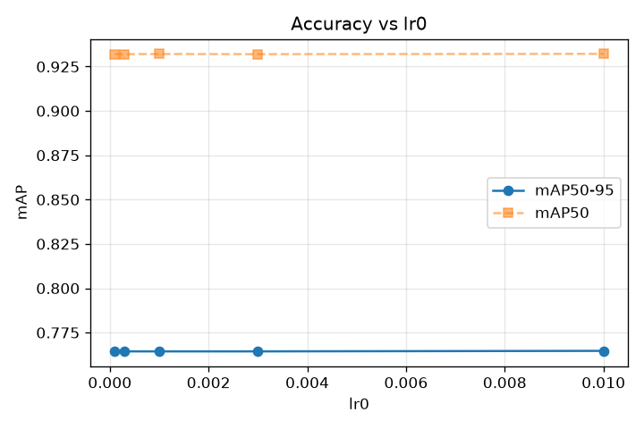
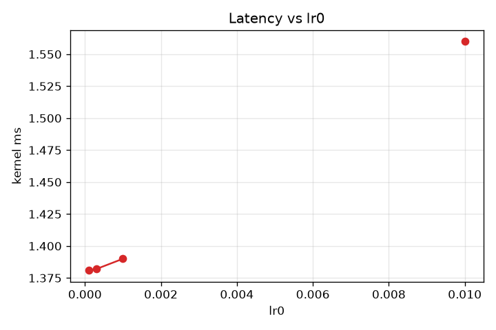

# lr0 sweep

Non-binary knob sweep — value → accuracy → latency. 5 runs. All other knobs at baseline.

**Peak mAP50-95 = 0.7647 at lr0=1e-2** (V2_lr0_1e-2).

## Results
| lr0 | mAP50 | mAP50-95 | kernel ms | version |
|---|---|---|---|---|
| 1e-4 | 0.9320 | 0.7644 | 1.381 | V2_lr0_1e-4 |
| 3e-4 | 0.9320 | 0.7644 | 1.382 | V2_lr0_3e-4 |
| 1e-3 | 0.9321 | 0.7644 | 1.390 | V2_lr0_1e-3 |
| 3e-3 | 0.9320 | 0.7644 | — | V2_lr0_3e-3 |
| 1e-2 | 0.9322 | 0.7647 | 1.560 | V2_lr0_1e-2 |

## Accuracy vs value

Shows the SHAPE — where mAP peaks, whether it's monotonic, plateaus, or degrades.

## Latency vs value

Latency varies across the sweep — see plot.
