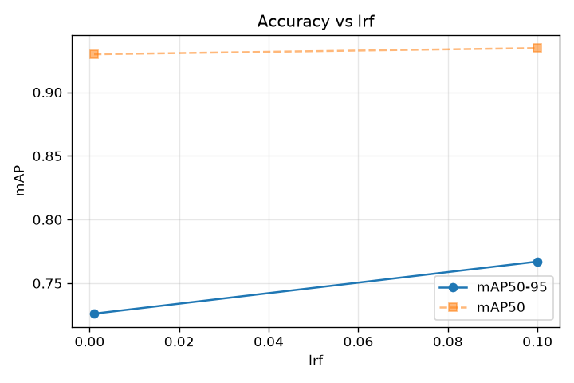
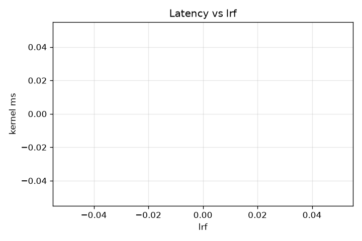

# lrf sweep

Non-binary knob sweep — value → accuracy → latency. 2 runs. All other knobs at baseline.

**Peak mAP50-95 = 0.7671 at lrf=0.1** (V2_lrf_0.1).

## Results
| lrf | mAP50 | mAP50-95 | kernel ms | version |
|---|---|---|---|---|
| 0.001 | 0.9298 | 0.7262 | — | V2_lrf_0.001 |
| 0.1 | 0.9347 | 0.7671 | — | V2_lrf_0.1 |

## Accuracy vs value

Shows the SHAPE — where mAP peaks, whether it's monotonic, plateaus, or degrades.

## Latency vs value

Latency not recorded.
