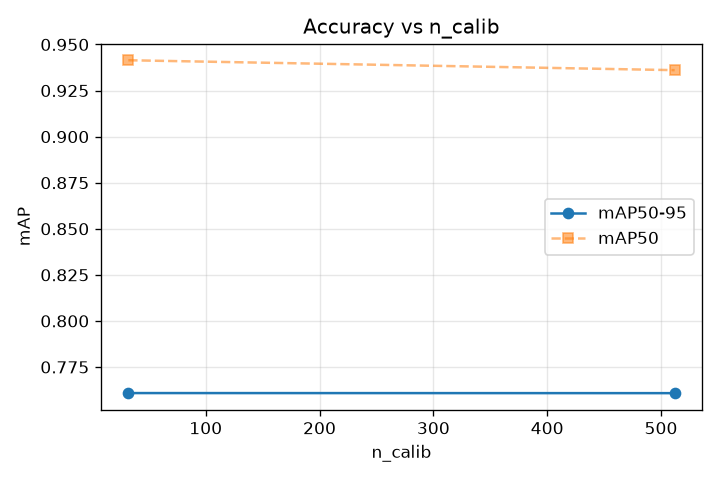
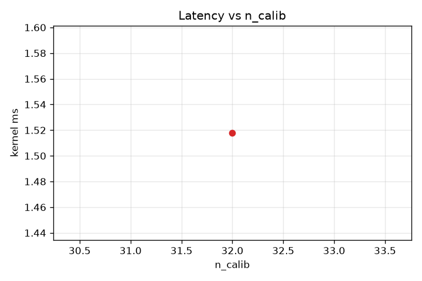

# n_calib sweep

Non-binary knob sweep — value → accuracy → latency. 2 runs. All other knobs at baseline.

**Peak mAP50-95 = 0.7609 at n_calib=32** (V2_ncalib_32).

## Results
| n_calib | mAP50 | mAP50-95 | kernel ms | version |
|---|---|---|---|---|
| 32 | 0.9414 | 0.7609 | 1.518 | V2_ncalib_32 |
| 512 | 0.9361 | 0.7608 | — | V2_ncalib_512 |

## Accuracy vs value

Shows the SHAPE — where mAP peaks, whether it's monotonic, plateaus, or degrades.

## Latency vs value

Latency varies across the sweep — see plot.
